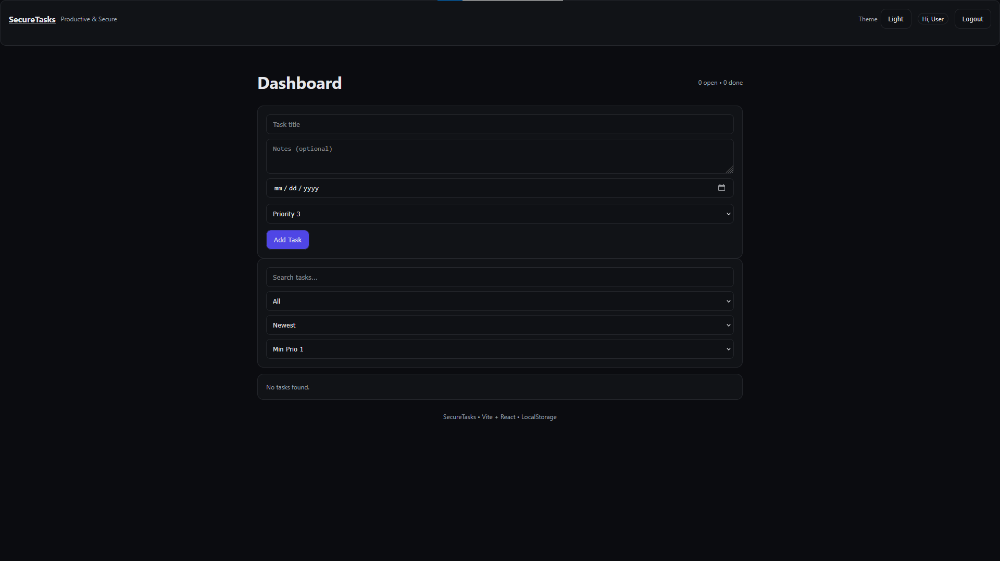

# SecureTasks

[](LICENSE)
[](https://securetasks.vercel.app)


SecureTasks is a modern task management app built with **Vite + React**.  
It includes authentication, protected routes, CRUD for tasks, search, filters, sorting, and dark/light themes — all with client-side security best practices.

---

## 🚀 Features
- **User Authentication** — Register/Login/Logout using localStorage (demo-safe).
- **Protected Routes** — Dashboard requires login.
- **CRUD Tasks** — Add, edit, delete tasks with notes and due dates.
- **Task Management Tools** — Search, filter by status, sort by date or priority.
- **Themes** — Toggle between Dark and Light modes.
- **Security** — Input sanitization with DOMPurify.
- **Responsive UI** — Works on desktop, tablet, and mobile.

---

## 🛠 Tech Stack
- **Frontend**: React.js, CSS3, HTML5
- **Build Tool**: Vite
- **State Management**: React Context API
- **Security**: DOMPurify for XSS prevention

---

## 📂 Project Structure
```
securetasks/
├── public/                 # Static assets
├── src/
│   ├── components/         # Navbar, TaskList, TaskForm, etc.
│   ├── pages/              # LoginPage, RegisterPage, DashboardPage
│   ├── context/            # AuthContext, ThemeContext
│   ├── hooks/              # Custom hooks
│   ├── utils/              # Helpers and sanitization
│   ├── App.jsx
│   ├── main.jsx
│   └── index.css
├── package.json
├── vite.config.js
└── index.html
```

---

## 🔧 Local Setup
```bash
# Install dependencies
npm install

# Start local development
npm run dev
```

---

## 📸 Screenshots
### Mobile View


### Desktop View


---

## 📅 Roadmap
- 🔐 Backend integration (Firebase/Auth0)
- 📱 Installable PWA version
- 🛎 Push notifications for due tasks

---

## 📄 License
This project is open source and available under the [MIT License](LICENSE).